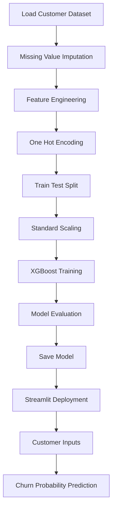

# 📉 Customer Churn Prediction using Machine Learning

### Predicting Customer Retention and Churn Risk through Advanced Behavioral Analytics

---

## 📌 Overview

Customer retention is one of the most critical challenges for subscription-based businesses. **Customer Churn Predictor** is an end-to-end machine learning solution designed to identify customers who are at risk of leaving a service before they actually churn.

Built using **XGBoost**, **feature engineering techniques**, and an intuitive **Streamlit dashboard**, the system analyzes customer demographics, engagement behavior, billing history, complaints, and service usage patterns to estimate churn probability in real time.

The project demonstrates a production-oriented machine learning workflow, combining large-scale data preprocessing, predictive modeling, feature scaling, probability estimation, and interactive deployment.

---

## ✨ Key Highlights

* 👥 **1,000,000 Customer Records Analysed**
* 🤖 XGBoost Classification Model
* 🧠 Advanced Feature Engineering
* ⚡ Interactive Streamlit Dashboard
* 📦 Serialized Model & Scaler Deployment
* 📊 Probability-Based Risk Assessment
* 🎯 90.08% Prediction Accuracy
* 📈 Real-Time Customer Retention Analytics
* 🚀 Enterprise-Scale Dataset Processing

---

## 📊 Dataset Summary

| Property            | Details               |
| ------------------- | --------------------- |
| Dataset Size        | 1,000,000 Records     |
| Features            | 32 Raw Features       |
| Missing Values      | Median Imputation     |
| Duplicate Records   | 0                     |
| Churn Rate          | 9.92%                 |
| Non-Churn Customers | 900,773               |
| Churn Customers     | 99,227                |
| Model Type          | Binary Classification |

---

## 🧠 Feature Engineering

Several domain-inspired features were engineered to enhance predictive performance.

### Generated Features

✔ Charges per Service

✔ Complaints per Support Call

✔ Income per Dependent

✔ Satisfaction to Complaint Ratio

✔ Tenure to Monthly Charge Ratio

These derived variables help capture customer engagement patterns that are difficult to observe using raw attributes alone.

---

## 🤖 Machine Learning Workflow

---

## 📈 Model Performance

| Metric    | Score      |
| --------- | ---------- |
| Accuracy  | **90.08%** |
| ROC-AUC   | **0.6817** |
| Precision | **55.67%** |
| Recall    | **0.57%**  |
| F1 Score  | **0.0113** |
| Algorithm | XGBoost    |

The model provides probability-based churn estimation, allowing businesses to proactively identify customers requiring retention efforts.

---

## 🖥️ Streamlit Dashboard Features

### Customer Profile Inputs

👤 Customer Demographics

💳 Billing Information

📞 Support Interaction History

📈 Usage Metrics

⭐ Satisfaction Levels

⚠ Complaint Records

### Prediction Outputs

📉 Churn Probability

🟢 Low Risk Customers

🔴 High Risk Customers

📊 Retention Insights

---

## 🏢 Business Applications

* Subscription Services
* Telecom Companies
* SaaS Platforms
* Banking Institutions
* Insurance Providers
* Customer Success Teams
* CRM & Retention Analytics

---

### 📈 Turning Customer Data into Retention Intelligence

⭐ If you found this project useful, consider giving it a star.

